# PMS — Complete User Workflow Documentation

**Generated:** 2026-07-14  
**Source:** Full reverse engineering of backend (.cs), frontend (.tsx/.ts), EF Core schema, SignalR hub, middleware, and configuration. No `.md` documentation files were used as input.  
**Methodology:** Every finding is traced to exact file paths and line numbers. Inferred behavior is explicitly labeled.

---

## Table of Contents

1. [Executive Summary](#1-executive-summary)
2. [Functional Module Catalog](#2-functional-module-catalog)
3. [Authentication & Authorization Analysis](#3-authentication--authorization-analysis)
4. [Workflow Catalog](#4-workflow-catalog)
   - 4.1 Authentication Workflows
   - 4.2 Project Management Workflows
   - 4.3 Task Lifecycle Workflows
   - 4.4 User Management Workflows
   - 4.5 Role Management Workflows
   - 4.6 Permissions Management Workflows
   - 4.7 Chat & Real-time Communication Workflows
   - 4.8 Reports & Analytics Workflows
   - 4.9 Work Diary Workflows
   - 4.10 Task Template Workflows
   - 4.11 Dashboard Workflows
5. [Workflow-to-Artifact Matrices](#5-workflow-to-artifact-matrices)
6. [Business Rules Catalog](#6-business-rules-catalog)
7. [Validation Matrix](#7-validation-matrix)
8. [SignalR Analysis](#8-signalr-analysis)
9. [Error Handling Analysis](#9-error-handling-analysis)
10. [Security Review](#10-security-review)
11. [Background Services](#11-background-services)
12. [Integration Dependency Map](#12-integration-dependency-map)
13. [Performance Observations](#13-performance-observations)
14. [Broken or Incomplete Workflows](#14-broken-or-incomplete-workflows)
15. [Missing Implementations](#15-missing-implementations)
16. [Prioritized Recommendations](#16-prioritized-recommendations)

---

## 1. Executive Summary

**PMS (Project & Task Management System)** is a full-stack SaaS work management application with:

| Component | Technology | Key Facts |
|-----------|-----------|-----------|
| Backend API | ASP.NET Core 6, C# | 12 controllers, 14+ services, JWT auth |
| Frontend SPA | React 19, TypeScript 5.8, Vite 6 | 15 routes, 7 contexts, lazy-loaded pages |
| Database | EF Core 6, SQL Server (remote) | ~25 entities, squashed migration baseline |
| Real-time | SignalR (`/hubs/chat`) | Chat, notifications, presence tracking |
| Background | 2 hosted services | Template scheduler (hourly), OTP cleanup |
| Auth | JWT + httpOnly refresh cookie | 15-min access token, 7-day refresh, PBKDF2 passwords |

**Confirmed Functional Modules:**
Authentication, Projects, Tasks (full lifecycle with state machine), Users, Roles, Page Permissions, Chat (rooms + files), Reports (5 report types), Work Diary, Task Templates (recurrence scheduler), Dashboard (stats + effort widgets), Admin Impersonation, OTP email flows.

**Confidence Level Key:**
- **High** — Directly traced from source code with no ambiguity
- **Medium** — Traced but relies on runtime DB state or configuration
- **Low** — Inferred from code patterns; requires business validation

---

## 2. Functional Module Catalog

| # | Module | Primary Files (Backend) | Primary Files (Frontend) | Status |
|---|--------|------------------------|--------------------------|--------|
| M01 | Authentication | `AuthController.cs`, `AuthService.cs` | `Auth.tsx`, `AuthContext.tsx` | **Implemented** |
| M02 | OTP Flows | `AuthController.cs`, `OtpService.cs`, `EmailService.cs` | `Auth.tsx` | **Implemented** |
| M03 | Project Management | `ProjectsController.cs`, `ProjectService.cs` | `Projects.tsx`, `ProjectDetails.tsx` | **Implemented** |
| M04 | Task Lifecycle | `TasksController.cs`, `TaskService.cs` | `Tasks.tsx`, `QuickViewContainer.tsx` | **Implemented** |
| M05 | Task Checklist | `TasksController.cs`, `TaskService.cs` | `ChecklistPanel.tsx` | **Implemented** |
| M06 | Task Comments | `TasksController.cs`, `TaskService.cs` | `CommentSection.tsx` | **Implemented** |
| M07 | Task Blocking | `TasksController.cs`, `TaskService.cs` | `TaskBlockPanel.tsx`, `BlockIssueDialog.tsx` | **Implemented** |
| M08 | Task QA Review | `TasksController.cs`, `TaskService.cs` | `TaskStatusActions.tsx` | **Implemented** |
| M09 | User Management | `UsersController.cs`, `UserService.cs` | `Users.tsx`, `UserDetails.tsx` | **Implemented** |
| M10 | Role Management | `RolesController.cs`, `RoleService.cs` | `Roles.tsx` | **Implemented** |
| M11 | Page Permissions | `PermissionsController.cs`, `AuthorizationService.cs` | `Settings.tsx`, `usePermissions.ts` | **Implemented** |
| M12 | Chat | `ChatController.cs`, `ChatService.cs`, `ChatHub.cs` | `Chat.tsx`, `ChatContext.tsx`, Chat components | **Implemented** |
| M13 | Reports | `ReportsController.cs`, `ReportService.cs` | `Reports.tsx` | **Implemented** |
| M14 | Work Diary | `WorkDiaryController.cs`, `WorkDiaryService.cs` | `Diary.tsx` | **Implemented** |
| M15 | Task Templates | `TaskTemplatesController.cs`, `TaskTemplateService.cs` | `TemplateList.tsx`, `TemplateForm.tsx`, `TemplateDetail.tsx` | **Implemented** |
| M16 | Admin Impersonation | `AuthService.cs` | `AuthContext.tsx` | **Implemented** |
| M17 | Dashboard | `TasksController.cs` (stats), `ReportService.cs` | `Dashboard.tsx` | **Implemented** |
| M18 | Database Backup | `DatabaseBackupService.cs` | None | **Not Implemented** (commented out in DI) |

---

## 3. Authentication & Authorization Analysis

### 3.1 Token Architecture

```
┌─────────────────────────────────────────────────────────────┐
│  JWT Access Token (HS256)                                    │
│  • Claims: NameIdentifier, Email, Role, (imp_by optional)   │
│  • Expiry: 15 minutes (JwtSettings:ExpiryMinutes)           │
│  • Stored: memory only (in-process variable in AuthContext)  │
├─────────────────────────────────────────────────────────────┤
│  Refresh Token (Base64, 64 random bytes)                    │
│  • Expiry: 7 days (JwtSettings:RefreshExpiryDays)           │
│  • Stored: httpOnly cookie pms_rt (Path=/api/auth)          │
│  • Fallback: localStorage pms_refresh_token                 │
│  • DB: RefreshToken table (rotated on each use)             │
└─────────────────────────────────────────────────────────────┘
```

**Source:** `AuthService.cs:306-336`, `AuthController.cs:75-89`, `AuthContext.tsx:69-72`

### 3.2 Authorization Hierarchy

```
Priority  Level         Check
  1       SystemAdmin   RoleId == 1 → full access to ALL resources
  2       Admin Role    Role.IsAdmin == true → full access to most resources
  3       User Override UserPagePermission (per user, per page)
  4       Role Default  RolePagePermission (per role, per page)
  5       Fallback      Bit=1 (view-only) when no permission row exists
```

**Permission Bitmap:**

| Bit | Decimal | Meaning |
|-----|---------|---------|
| Bit 0 | 1 | View |
| Bit 1 | 2 | Create |
| Bit 2 | 4 | Update |
| Bit 3 | 8 | Delete |
| All | 15 | Full Access (seeded for SystemAdmin) |

**Source:** `AuthorizationService.cs:64-93`, `PermissionsController.cs:41-48`

### 3.3 Rate Limiting

- **Middleware:** `LoginRateLimitMiddleware.cs`
- **Scope:** `POST /api/auth/login`, `POST /api/auth/refresh`, `POST /api/auth/forgot-password`, `POST /api/auth/register/initiate`
- **Limit:** 5 requests per IP per 60-second sliding window
- **Response:** HTTP 429 with JSON `{"success":false,"message":"Too many attempts. Please wait a minute and try again."}`
- **Note:** Uses in-memory `ConcurrentDictionary` — resets on app restart; not distributed-safe

### 3.4 CORS Policy

- Origins: `http://localhost:3000`, `http://localhost:5178`
- Methods: Any, Headers: Any, Credentials: Allowed
- **Note:** Production should restrict origins — `AllowAll` policy is wide open

---

## 4. Workflow Catalog

### 4.1 Authentication Workflows

---

#### WF-AUTH-01: User Login

**Purpose:** Authenticate a user and issue tokens.

**Roles:** Any (unauthenticated)

**Entry Point:** `GET /auth` → `Auth.tsx` → Login view

**Trigger:** User submits login form

**Preconditions:** User account exists, `IsActive=true`, not soft-deleted

**Postconditions:** JWT stored in memory, refresh token in httpOnly cookie and localStorage; user redirected to `/`

**Authorization:** None (AllowAnonymous)

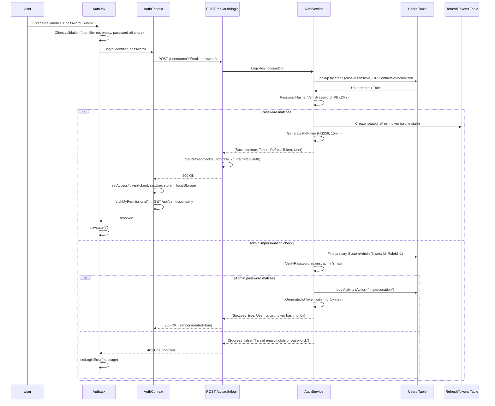

**Business Rules:**
- Email login: case-insensitive (`email.ToLower()`)
- Mobile login: extracts digits only, matches `ContactNoNormalized` (min 7 digits)
- Inactive accounts show same error as wrong password (no enumeration)
- Impersonation only available when target is NOT SystemAdmin
- Rate limit: 5 attempts per minute per IP

**Error Paths:**
| Condition | HTTP | Message |
|-----------|------|---------|
| User not found | 401 | "Invalid email/mobile or password." |
| Wrong password | 401 | "Invalid email/mobile or password." |
| Account inactive | 401 | "Invalid email/mobile or password." |
| Rate limited | 429 | "Too many attempts. Please wait a minute and try again." |

---

#### WF-AUTH-02: OTP-based Registration (2-step)

**Purpose:** Register a new user account with email verification.

**Roles:** Any (unauthenticated)

**Entry Point:** `GET /auth` → Register view

**Trigger:** User clicks "New User? Register from here"

**Preconditions:** Email and username not already taken

**Postconditions:** User account created with default (lowest non-admin) role; automatically logged in

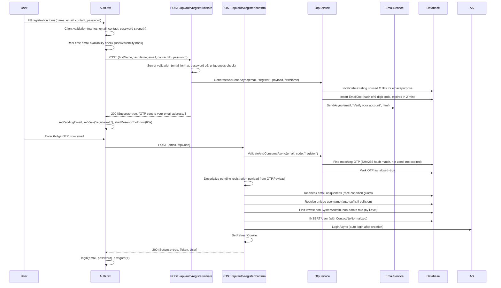

**Business Rules:**
- Password must have ≥1 uppercase, ≥1 lowercase, ≥1 digit, ≥6 chars
- Email availability checked in real-time via `GET /api/auth/check-availability`
- OTP expires in 2 minutes (configurable via `OTPExpiresAt`)
- Resend has 60-second cooldown
- Username auto-derived from email prefix; numeric suffix appended if collision
- New user gets the lowest `Level` non-admin role (excludes RoleId=1)
- ContactNoNormalized stores digits-only for mobile login

**Validation:**
- `validateName()` → `src/lib/validation.ts`
- `validateEmail()` → `src/lib/validation.ts`
- `validateContact()` → `src/lib/validation.ts`
- Password regex: `/^(?=.*[a-z])(?=.*[A-Z])(?=.*\d)/`

---

#### WF-AUTH-03: Forgot Password / Reset via OTP

**Purpose:** Allow users to reset a forgotten password via email OTP.

**Entry Point:** `GET /auth` → Login view → "Forgot Password?" link

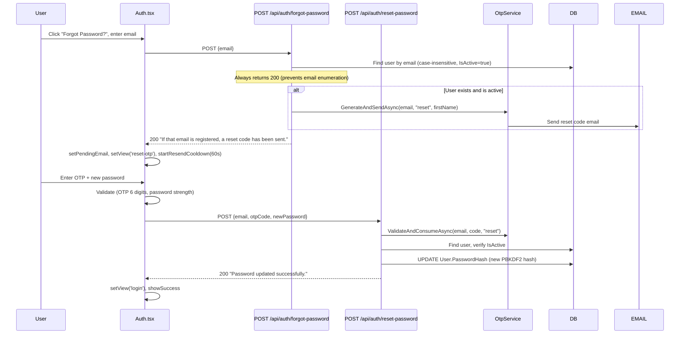

**Security Notes:**
- Anti-enumeration: always returns 200 regardless of whether email exists
- OTP stored as SHA256 hash (never plaintext)
- Existing unused OTPs for same email+purpose are invalidated on new request
- New password must meet strength requirements (uppercase, lowercase, digit, ≥6 chars)

---

#### WF-AUTH-04: Token Refresh

**Purpose:** Silently refresh expired JWT access tokens.

**Trigger:** App startup (`checkAuthStatus()`) or 401 response from API (automatic)

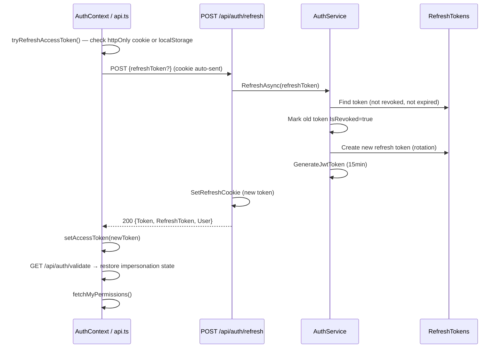

**Notes:** Refresh token is rotated on each use. Old token is immediately revoked. If refresh fails, user is redirected to `/auth`.

---

#### WF-AUTH-05: Logout

**Trigger:** User clicks logout in UI (sidebar)

**Flow:**
1. Frontend fires best-effort `POST /api/auth/logout` (revokes all refresh tokens for user)
2. Frontend clears: in-memory access token, `localStorage.pms_user`, `localStorage.pms_token`, `localStorage.pms_refresh_token`
3. `window.location.href = '/auth'` (hard redirect to clear all state)

**Source:** `AuthController.cs:63-73`, `AuthContext.tsx:112-128`

---

#### WF-AUTH-06: Admin Impersonation

**Purpose:** SystemAdmin logs in as any other user using the admin's own password.

**Trigger:** On login form, enter target user's email/mobile + SystemAdmin's password

**Business Rules:**
- Only the primary SystemAdmin (lowest Id with RoleId=1, IsActive=true) can impersonate
- Cannot impersonate another SystemAdmin (RoleId=1 check)
- JWT contains `imp_by` claim with admin's userId
- UI shows impersonation banner (`IsImpersonated=true`, `ImpersonatedByName`)
- Activity log entry created (Action="Impersonation", TargetType="User")

**Source:** `AuthService.cs:76-110`

---

### 4.2 Project Management Workflows

---

#### WF-PROJ-01: Browse & View Projects

**Entry Point:** `/projects` → `Projects.tsx`

**Roles:** Any authenticated user with View permission on `/projects`

**API:** `GET /api/projects` → `ProjectsController.GetAll()` → `ProjectService.GetAllProjectsAsync()`

**Data Loaded:** Projects list including: Id, Code, Name, Status, Owner, MemberCount, TaskCount, Progress, Members, AssignmentHistory, Modules

**Frontend Behavior:**
- DataContext pre-fetches all projects at app load (`DataContext.tsx:96`)
- Projects displayed as cards with status, member avatars, progress bar
- Click project → navigate to `/projects/:id`

---

#### WF-PROJ-02: Create Project

**Entry Point:** `/projects` → "+ New Project" button

**Roles:** SystemAdmin or Admin role + Create permission on `/projects`

**Authorization Check:** `IsAdminAsync() AND CanCreateAsync("/projects")` (both must be true)

**Source:** `ProjectsController.cs:47-55`

**API:** `POST /api/projects`

**Fields:** Name (required), Description, Status, StartDate, EndDate, OwnerId, Modules (list of strings)

**Postconditions:** Project created with Code (auto-generated), CreatedById set to current user

---

#### WF-PROJ-03: Edit Project

**Entry Point:** `/projects/:id` → Edit button

**Roles:** SystemAdmin or Admin + Update permission on `/projects`

**API:** `PUT /api/projects/{id}`

**Source:** `ProjectsController.cs:57-65`

---

#### WF-PROJ-04: Delete Project

**Roles:** SystemAdmin or Admin + Delete permission on `/projects`

**API:** `DELETE /api/projects/{id}`

**Source:** `ProjectsController.cs:67-76`

---

#### WF-PROJ-05: Reassign Project Owner

**Purpose:** Change the project owner with an auditable reason.

**Roles:** Admin only

**Entry Point:** `/projects/:id` → Reassign button → `ReassignModal.tsx`

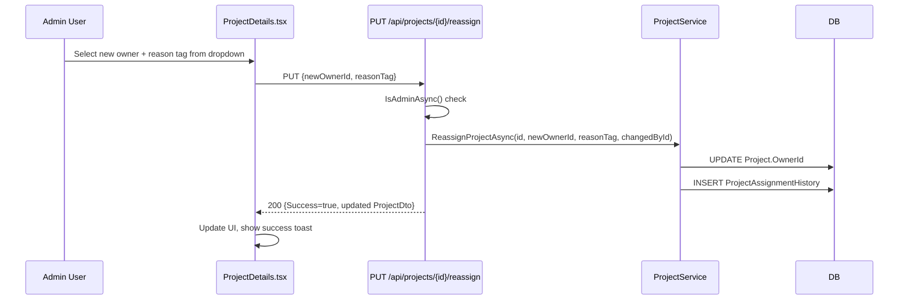

**Valid Reason Tags:** `ReasonTags.Valid` → "Resignation", "Workload Balancing", "Management Decision", "Unavailability", "No Resource", "Unable to Complete", "Admin Decision", "Other"

**Source:** `ProjectsController.cs:78-90`, `GeneralDtos.cs:8-14`

---

#### WF-PROJ-06: Manage Project Members

**Three sub-actions (all Admin only):**

| Action | API | Source |
|--------|-----|--------|
| Assign user | `POST /api/projects/{id}/assign` + `?role=Developer` | `ProjectsController.cs:100-108` |
| Remove member | `DELETE /api/projects/{id}/members/{userId}` | `ProjectsController.cs:110-118` |
| Bulk set members | `PUT /api/projects/{id}/members` (list of userIds) | `ProjectsController.cs:120-128` |

---

#### WF-PROJ-07: View Project Details

**Entry Point:** `/projects/:id` → `ProjectDetails.tsx`

**API:** `GET /api/projects/{id}` + `GET /api/projects/{id}/assignment-history`

**Data Displayed:** Project info, members, task list for this project, assignment history timeline

---

### 4.3 Task Lifecycle Workflows

---

#### WF-TASK-01: Create Task

**Entry Point:** `/tasks` → "New Task" button → Task creation modal

**Roles:** Admin/Creator permission OR project creator/owner

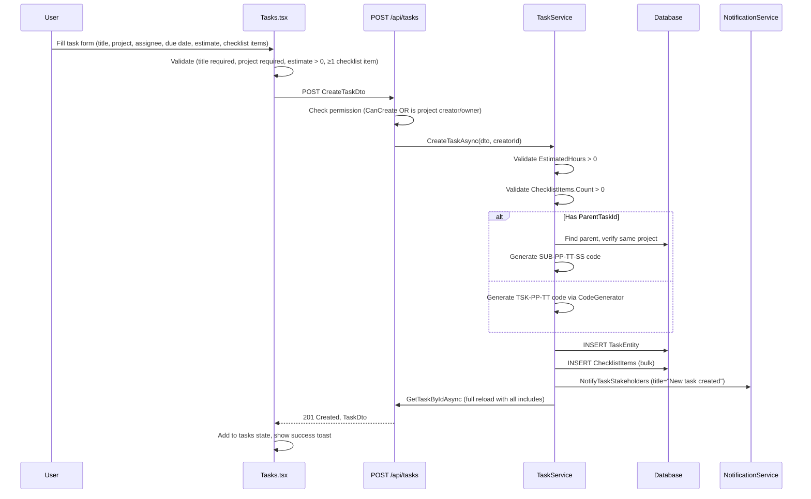

**Mandatory Fields (enforced server-side):**
- `EstimatedHours > 0` (validation: `[Range(0.01, 100000)]`)
- At least one `ChecklistItems` entry
- Valid `ProjectId`
- If `ParentTaskId` set: parent must exist and be in same project

**Auto-generated:** `Code` (format: `TSK-PP-TT` for top-level, `SUB-PP-TT-SS` for subtasks), `SeqNumber`

**Source:** `TaskService.cs:256-313`, `TasksController.cs:52-67`

---

#### WF-TASK-02: Task Status State Machine

**The complete valid status graph:**

```
new ─────────────────────────────────────► cancelled
 │                                              │
 ▼                                              │
in-progress ──► blocked ──► in-progress        ▼
 │                                            new
 ▼
in-review ──► in-progress (manager rejects)
 │
 └──► completed (QA pass or manager approve)
 └──► in-progress (manager sends back)
 └──► cancelled

completed ──► in-progress (manager reopen only)
cancelled ──► new (manager restore only)
```

**Source:** `TaskService.cs:358-371` (`AllowedEdges` dictionary)

**Status Labels (frontend):** `new` = "New", `in-progress` = "In Progress", `blocked` = "Blocked", `in-review` = "In Review", `completed` = "Completed", `cancelled` = "Cancelled"

**Source:** `types/index.ts:STATUS_LABELS`

---

#### WF-TASK-03: Start Task

**Entry Point:** Task card → "Start Task" button

**Roles:** Task assignee only

**API:** `POST /api/tasks/{id}/start`

**Business Rules:**
- Only the assignee can start
- Cannot start if already started (`StartedAt != null`)
- Cannot start a completed task
- Sets `StartedAt`, `StartedById`, transitions status to `in-progress`
- Logs Activity and TaskStatusHistory

**Source:** `TaskService.cs:709-750`

---

#### WF-TASK-04: Change Task Status

**Entry Point:** Task detail panel → status action buttons (`TaskStatusActions.tsx`)

**API:** `PUT /api/tasks/{id}/status` with `ChangeStatusDto`

**Required Fields:** `ToStatus`, optional `Reason` (required for "blocked"), optional `ActualHours` (required on most transitions)

```mermaid
activity
    :User clicks status change button;
    :Validate transition via AllowedEdges;
    if (Invalid edge?) then (yes)
        :Return error "Cannot move from X to Y";
        stop
    endif
    if (task.HasIssues?) then (yes)
        :Return error "Clear HasIssues first";
        stop
    endif
    if (task.IsPaused?) then (yes)
        :Return error "Unpause first";
        stop
    endif
    if (has active blocks AND not admin?) then (yes)
        :Return error "Unblock first";
        stop
    endif
    if (to="blocked" AND no reason?) then (yes)
        :Return error "Reason required";
        stop
    endif
    if (to="in-review" AND progress < 100%) then (yes)
        :Return error "Complete all checklist items";
        stop
    endif
    if (to="completed" AND has checklist AND progress < 100%) then (yes)
        :Return error "Complete all checklist items";
        stop
    endif
    if (RequiresQA AND to="completed" AND from="in-review") then (yes)
        if (isQA OR isManager?) then (no)
            :Return error "Only QA reviewer can pass";
            stop
        endif
    endif
    :Update task.Status;
    if (to="in-progress" AND StartedAt == null) then (yes)
        :Stamp StartedAt, StartedById;
    endif
    if (to="blocked") then (yes)
        :Create TaskBlockEntry;
    endif
    if (from="blocked") then (yes)
        :Resolve active BlockEntries;
    endif
    if (to="in-review" AND QaAssigneeId set AND current assignee != QA) then (yes)
        :Auto-swap assignee to QA reviewer;
        :Log TaskAssignmentHistory;
    endif
    :Log TaskStatusHistory;
    :Log Activity;
    :SendStatusNotifications via SignalR;
    stop
```

**Role Gates per Target Status:**

| Target | Who Can |
|--------|---------|
| `in-progress` (from `completed`) | Manager (admin, creator, project owner) |
| `in-progress` (from `in-review`) | Manager |
| `in-progress` (from `blocked`) | Assignee or manager |
| `in-review` | Assignee or manager |
| `completed` (from `in-review`, RequiresQA=true) | QA reviewer or manager |
| `completed` (from `in-review`, RequiresQA=false) | Manager |
| `completed` (other) | Assignee or manager |
| `blocked` | Assignee or manager |
| `cancelled` | Assignee or manager |
| `new` (restore from `cancelled`) | Manager |

**Source:** `TaskService.cs:378-474`

---

#### WF-TASK-05: QA Review Flow

**Purpose:** Task requiring QA goes through a formal review phase.

**Trigger:** Task with `RequiresQA=true` submitted for review

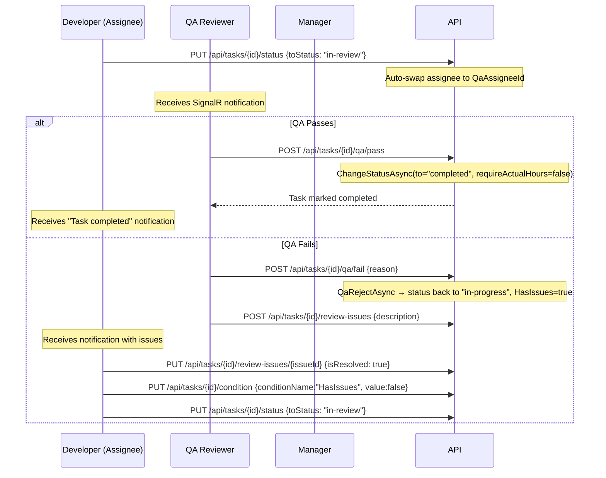

**API Endpoints:**
- `POST /api/tasks/{id}/qa/pass` → calls `ChangeStatusAsync(to="completed", requireActualHours=false)`
- `POST /api/tasks/{id}/qa/fail` → calls `QaRejectAsync` → `in-progress` + `HasIssues=true`
- `POST /api/tasks/{id}/review-issues` → add review issue
- `PUT /api/tasks/{id}/review-issues/{issueId}` → resolve/reopen issue
- `DELETE /api/tasks/{id}/review-issues/{issueId}` → delete issue
- `POST /api/tasks/{id}/review/complete` → `CompleteReviewAsync` (non-QA completion)

**Source:** `TasksController.cs:220-332`, `TaskService.cs` QA methods

---

#### WF-TASK-06: Checklist Management

**Purpose:** Track completion of sub-items before status transitions.

**Business Rules (all enforced server-side):**
- Task must be **started** (`StartedAt != null`) before any checklist item can be toggled
- Only the **current assignee** can toggle checklist items
- 100% checklist completion required before `in-review` or `completed`
- Checklist progress (`Progress`) is auto-recalculated after each toggle

**API Endpoints:**

| Action | HTTP | Endpoint | Auth |
|--------|------|----------|------|
| Add item | POST | `/api/tasks/{id}/checklist` | Task creator or project owner |
| Toggle item | PUT | `/api/tasks/{id}/checklist/{itemId}/toggle` | Assignee only |
| Update item | PUT | `/api/tasks/{id}/checklist/{itemId}` | Task creator or project owner |
| Delete item | DELETE | `/api/tasks/{id}/checklist/{itemId}` | Task creator or project owner |
| Mark all complete | POST | `/api/tasks/{id}/checklist/mark-all-complete` | Assignee only |

**Source:** `TasksController.cs:351-413`, `TaskService.cs:1321-1567`

---

#### WF-TASK-07: Task Blocking

**Purpose:** Flag a task as blocked with a reason; auto-resolves on reassignment.

**Entry Point:** Task detail → Block panel → `TaskBlockPanel.tsx` / `BlockIssueDialog.tsx`

**Block Flow:**
1. User clicks "Block Task" → enters reason
2. `PUT /api/tasks/{id}/block` with `{isBlocked: true, reason: "..."}`
3. Server: create `TaskBlockEntry`, set `task.Status = "blocked"` if not already
4. Notification sent to all task stakeholders
5. Block status shown in task card UI

**Unblock Flow:**
1. `PUT /api/tasks/{id}/block` with `{isBlocked: false}`
2. Server: deactivate ALL active block entries (`IsActive=false`, `ResolvedAt=now`)
3. If task was `blocked`: auto-transition to `in-progress`
4. If no `StartedAt`: stamp it now

**Who Can Block:** Assignee, Admin, or Project Owner/Creator  
**Who Can Unblock:** Task creator, Project owner/creator, Assignee, Admin

**Auto-resolve:** Reassignment via `ReassignTaskAsync` auto-resolves active blocks and if status was `blocked`, returns task to `in-progress` or `new` (if never started)

**Source:** `TaskService.cs:1592-1718`

---

#### WF-TASK-08: Task Reassignment

**Purpose:** Transfer task to a new assignee with an auditable reason tag.

**Roles:** Admin, task creator, or project owner/creator

**API:** `PUT /api/tasks/{id}/reassign`

**Flow:**
1. Validate reason tag against `ReasonTags.Valid`
2. Reject if task is `completed`
3. Auto-resolve all active block entries
4. If status was `blocked`: auto-transition to resume status
5. Log `TaskAssignmentHistory` with previous/new assignee, reason tag, changer
6. Log Activity

**Valid Reason Tags:** "Resignation", "Workload Balancing", "Management Decision", "Unavailability", "No Resource", "Unable to Complete", "Admin Decision", "Other"

**Source:** `TaskService.cs:620-707`

---

#### WF-TASK-09: Task Comments

**Purpose:** Threaded discussion on a task.

**API:**
- `POST /api/tasks/{id}/comments` → add comment
- `GET /api/tasks/{id}/comments?userId=&from=&to=` → get filtered comments

**Authorization:** Only task creator, current assignee, or project owner/creator can comment

**Source:** `TasksController.cs:108-137`

---

#### WF-TASK-10: Issue Entry Management (HasIssues Condition)

**Purpose:** Track non-blocking issues on a task (separate from QA review issues).

**API Endpoints:**
- `POST /api/tasks/{id}/issues` — add issue (requires description ≤500 chars)
- `PUT /api/tasks/{id}/issues/{entryId}` — resolve/reopen issue
- `DELETE /api/tasks/{id}/issues/{entryId}` — delete issue
- `PUT /api/tasks/{id}/condition` — toggle `HasIssues` or `IsPaused` flag

**HasIssues Impact:** When `HasIssues=true`, ALL status transitions are blocked until cleared

**IsPaused Impact:** When `IsPaused=true`, ALL status transitions are blocked until unpaused

**Source:** `TasksController.cs:244-286`, `GeneralDtos.cs:476-479`

---

#### WF-TASK-11: Task Effort Tracking

**Purpose:** Automatically track time spent in each status (no manual timers required).

**Data Source:** `TaskStatusHistories` + `TaskAssignmentHistories` tables

**API:** `GET /api/tasks/{id}/effort` → `TaskEffortDto`

**Effort Categories:**
- `ProductiveSeconds`: time in `in-progress`
- `PausedSeconds`: time in `blocked` (note: "paused" status removed; blocked maps here)
- `BlockedSeconds`: time in `blocked`
- `UnderReviewSeconds`: time in `in-review`
- `OtherSeconds`: all other statuses

**Working Hours Filter:** Only counts time within configured working hours (default 10:00–19:00 IST). Configured via `WorkingHoursOptions` in `appsettings.json`.

**Per-User Attribution:** Intersects status segments with assignment windows to attribute effort to correct user even across reassignments.

**Source:** `TaskService.cs:972-1143`, `EffortHelpers.cs`

---

### 4.4 User Management Workflows

---

#### WF-USER-01: List & Search Users

**Entry Point:** `/users` → `Users.tsx`

**Roles:** Admin only (for full list), any authenticated user (assignable list)

**APIs:**
- `GET /api/users` → all users, excludes SystemAdmin (Id ≤ 1) — Admin only
- `GET /api/users/assignable` → active, non-deleted, non-SystemAdmin users — any authenticated

**Source:** `UsersController.cs:32-54`

---

#### WF-USER-02: Create User (Admin)

**API:** `POST /api/users`

**Roles:** Admin only

**Fields:** UserName (optional, auto-generated), Email (required), FirstName, LastName, Password (≥6), RoleId, AvatarUrl, ContactNo, IsActive

**Validation:**
- `[EmailAddress]`, `[StringLength(256)]`
- `[Required]` on FirstName, LastName, Email
- `[MinLength(6)]` on Password
- `[Phone]` on ContactNo
- `[StringLength(50)]` on UserName

**Source:** `UsersController.cs:70-78`, `GeneralDtos.cs:289-305`

---

#### WF-USER-03: Edit User Profile

**API:** `PUT /api/users/{id}`

**Roles:** Any user can edit their own profile; Admin can edit any user

**Source:** `UsersController.cs:80-90`

---

#### WF-USER-04: Soft-Delete User

**API:** `DELETE /api/users/{id}`

**Roles:** Admin only

**Behavior:** Sets `IsDeleted=true` (soft delete, not a hard DELETE). User cannot log in after deletion. Appears in admin list as deleted.

**Source:** `UsersController.cs:92-99`, `UserService.cs` (inferred from `IsDeleted` field in DB)

---

#### WF-USER-05: Reactivate Deleted User

**API:** `PUT /api/users/{id}/reactivate`

**Roles:** SystemAdmin only (RoleId=1 check at controller level)

**Source:** `UsersController.cs:112-122`

---

#### WF-USER-06: Toggle User Active/Inactive

**API:** `PATCH /api/users/{id}/status` with `{isActive: bool}`

**Roles:** Admin only. Protected for SystemAdmin (Id ≤ 1).

**Source:** `UsersController.cs:103-110`

---

#### WF-USER-07: Admin Password Reset

**API:** `POST /api/users/{id}/reset-password`

**Roles:** SystemAdmin or Admin-role user

**Behavior:** Sets password to hardcoded default `"Az@12345"`. Cannot reset SystemAdmin's own password via this endpoint.

**Source:** `UsersController.cs:124-149`

---

#### WF-USER-08: View User Details

**Entry Point:** `/users/:id` → `UserDetails.tsx`

**API:** `GET /api/users/{id}`

**Roles:** User can view their own profile; Admin can view any user profile. Users with Id ≤ 1 are protected.

**Source:** `UsersController.cs:57-68`

---

### 4.5 Role Management Workflows

---

#### WF-ROLE-01: List Roles

**API:** `GET /api/roles`  
**Roles:** Admin only  
**Source:** `RolesController.cs:25-31`

---

#### WF-ROLE-02: Create/Update Role

**API:** `POST /api/roles` (upsert — if `RoleDto.Id > 0`, updates; otherwise creates)  
**Roles:** Admin only  
**Fields:** Name, Code, Level, Description, IsAdmin, IsActive  
**Protected:** Roles with Id ≤ 1 (SystemAdmin) cannot be retrieved via `GET /api/roles/{id}`  
**Source:** `RolesController.cs:44-53`

---

#### WF-ROLE-03: Delete Role

**API:** `DELETE /api/roles/{id}`  
**Roles:** Admin only  
**Source:** `RolesController.cs:55-63`

---

### 4.6 Permissions Management Workflows

---

#### WF-PERM-01: View My Effective Permissions

**Purpose:** Frontend loads current user's page-level permissions after login.

**API:** `GET /api/permissions/my`

**Roles:** Any authenticated user

**Response:** Array of `{pageModuleId, route, permissions}` where `permissions` is the effective bitmap

**Frontend:** `AuthContext.tsx:31-42` → `fetchMyPermissions()` → stored in `pagePermissions` state → used by `usePermissions.ts` hook to guard UI elements

---

#### WF-PERM-02: Manage Role Permissions (SystemAdmin)

**Entry Point:** `/settings` → `Settings.tsx`

**APIs:**
- `GET /api/permissions/pages` — list all PageModules
- `GET /api/permissions/roles` — list all roles
- `GET /api/permissions/role/{roleId}` — get role's current permissions
- `PUT /api/permissions/role/{roleId}` — update role's permissions

**Roles:** SystemAdmin only (`IsSystemAdminAsync()`)

**Source:** `PermissionsController.cs:73-134`

---

#### WF-PERM-03: Manage User-Level Permission Overrides (SystemAdmin)

**APIs:**
- `GET /api/permissions/user/{userId}` — get user's overrides
- `PUT /api/permissions/user/{userId}` — replace all user overrides (non-zero only stored)
- `DELETE /api/permissions/user/{userId}` — clear all user overrides (reverts to role defaults)

**Roles:** SystemAdmin only

**Source:** `PermissionsController.cs:136-196`

---

### 4.7 Chat & Real-time Communication Workflows

---

#### WF-CHAT-01: Connect to Chat

**Trigger:** `ChatContext.tsx` → `ChatProvider` mounts (authenticated user navigates to `/chat` or app initializes)

**SignalR Connection:** `HubConnectionBuilder` → `/hubs/chat?access_token=<JWT>` (token in query string for WebSocket handshake)

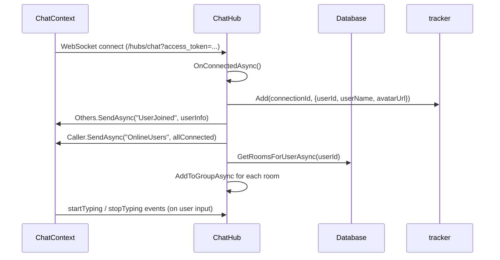

**Source:** `ChatHub.cs:20-46`

---

#### WF-CHAT-02: Send Message

**Two channels:**
1. **Global channel** (roomId = null) → broadcasts to ALL connected users
2. **Room channel** (roomId set) → broadcasts to room members only (after membership check)

**API (REST fallback):** `GET /api/chat/messages?count=50&beforeId=&roomId=` — load history

**SignalR method:** `SendMessage(SendMessageDto)` → `ChatService.SaveMessageAsync()` → `DB INSERT` → broadcast `ReceiveMessage`

**Message Types:** `text`, `file`

**Reply Support:** `ReplyToId` links to a parent message

**Source:** `ChatHub.cs:57-74`

---

#### WF-CHAT-03: File Upload in Chat

**API:** `POST /api/chat/upload` (multipart form-data)

**Limits:** 25MB max (`[RequestSizeLimit(25_000_000)]`)

**Security:**
- File validation including magic-byte check (`ChatService.ValidateFileAsync()`)
- Path traversal prevention: resolved path must start with `wwwRoot + DirectorySeparatorChar`
- Files stored in `wwwroot/uploads/chat/`

**Flow:**
1. Upload file → returns `ChatAttachmentDto` with `attachmentId`
2. Send message with `{messageType: "file", attachmentId}`
3. Download: `GET /api/chat/file/{attachmentId}`

**Source:** `ChatController.cs:54-88`

---

#### WF-CHAT-04: Chat Rooms

**APIs:**
- `GET /api/chat/rooms` — rooms where current user is a member (+ unread count, last message)
- `POST /api/chat/rooms` — create named group room
- `POST /api/chat/rooms/direct/{otherUserId}` — get or create 1:1 DM room

**Room Types:** `public` (group), `direct` (DM — auto-name, idempotent creation)

**Source:** `ChatController.cs:29-52`

---

#### WF-CHAT-05: Typing Indicators

**SignalR methods:**
- `StartTyping(roomId?)` → broadcasts `TypingStarted(userId, userName)` to others
- `StopTyping(roomId?)` → broadcasts `TypingStopped(userId)` to others

**Source:** `ChatHub.cs:85-101`

---

#### WF-CHAT-06: In-App Notifications via SignalR

**Purpose:** Push notifications to specific users when task events occur.

**Backend:** `NotificationService.cs` → `IHubContext<ChatHub>` → `Clients.User(userId).SendAsync("ReceiveNotification", notification)`

**Frontend:** `ChatContext.tsx` → listens for `ReceiveNotification` → calls `DataContext.ingestNotification()`

**Frontend behavior:**
- All notifications → notification feed (bell icon, `NotificationDropdown.tsx`)
- Types in `DIALOG_TYPES` (`block`, `issue`, `overdue`) → also show modal dialog (`BlockIssueDialog.tsx`)
- Notification sound: `/notification.mp3` if file exists in `public/`

**Notification triggers:**
| Event | Recipients |
|-------|-----------|
| Task created | Assignee, creator, project owner |
| Task status changed to `in-review` | Task managers + QA reviewer |
| Task `completed` | Assignee + managers |
| Task `blocked` / `cancelled` | Managers |
| Task `in-progress` (from completed/review) | Assignee |
| Task blocked | All stakeholders |
| Task unblocked | All stakeholders |
| Checklist item toggled | All stakeholders (except actor) |

**Source:** `NotificationService.cs`, `TaskService.cs:877-946`, `DataContext.tsx:56-61`

---

### 4.8 Reports & Analytics Workflows

---

#### WF-RPT-01: User Effort Report

**API:** `GET /api/reports/user-effort?from=&to=`

**Roles:** Admin sees all users; non-admin sees only own data

**Data:** Per-user aggregation: task count, productive seconds, paused seconds, blocked seconds, under-review seconds, total elapsed

**Source:** `ReportsController.cs:26-36`, `ReportService.cs`

---

#### WF-RPT-02: Status Transition Report

**API:** `GET /api/reports/user-transitions?from=&to=`

**Data:** Per-user count of status transitions, most common transition, full breakdown by (fromStatus, toStatus)

**Source:** `ReportsController.cs:38-47`

---

#### WF-RPT-03: Per-Task Effort for a User

**API:** `GET /api/reports/user-task-effort?userId=&from=&to=`

**Roles:** Admin can query any user; non-admin can only query self (403 otherwise)

**Data:** `UserTaskEffortReportDto` → list of tasks with effort breakdown

**Source:** `ReportsController.cs:50-62`

---

#### WF-RPT-04: Per-Day Effort for a User

**API:** `GET /api/reports/user-daily-effort?userId=&from=&to=`

**Roles:** Same as WF-RPT-03

**Data:** `UserDailyEffortReportDto` → list of calendar days with effort breakdown + task count

**Source:** `ReportsController.cs:64-75`

---

#### WF-RPT-05: Daily Utilization Report

**API:** `GET /api/reports/daily-utilization?userId=&month=&year=`

**Roles:** Same as WF-RPT-03

**Data:** Month-view: each day shows diary hours + task hours + total hours vs 8-hour target. Counts: total working days, days complete, days partial.

**Source:** `ReportsController.cs:77-90`

---

#### WF-RPT-06: Hours Summary

**API:** `GET /api/reports/hours-summary?from=&to=&userId=&projectId=`

**Roles:** Admin sees all; non-admin sees own data only (self-filter applied by service)

**Data:** `HoursSummaryDto` → by-user, by-task, by-project breakdowns with effort seconds

**Source:** `ReportsController.cs:92-103`

---

### 4.9 Work Diary Workflows

---

#### WF-DIARY-01: View / Manage My Work Diary

**Entry Point:** `/diary` → `Diary.tsx`

**Purpose:** Daily journal entries for work done; supports hours tracking, category, and optional project linkage.

**APIs:**
- `GET /api/workdiary?month=&year=&from=&to=` → own entries, filterable by month/year or date range
- `GET /api/workdiary/all?userId=&month=&year=&from=&to=` → admin: all users
- `GET /api/workdiary/categories` → list of valid categories (constant in `WorkDiaryService`)
- `GET /api/workdiary/projects` → all projects for dropdown (no membership check)
- `POST /api/workdiary` → create entry
- `PUT /api/workdiary/{id}` → update (own entries only, enforced by service)
- `DELETE /api/workdiary/{id}` → delete (own entries only)

**Fields:** Date (required), Description (required), Category (optional), HoursSpent (optional), ProjectId (optional)

**Source:** `WorkDiaryController.cs`, `GeneralDtos.cs:745-762`

---

### 4.10 Task Template Workflows

---

#### WF-TMPL-01: Create Task Template

**Entry Point:** `/templates/new` → `TemplateForm.tsx`

**Roles:** Admin only (all template endpoints require `IsAdminAsync()`)

**API:** `POST /api/task-templates`

**Fields (SaveTaskTemplateDto):**
- Name (required, ≤200), Description, ProjectId, Module
- RecurrenceType: `daily`, `weekly`, `monthly`, `custom`
- DayOfWeek (0-6), DayOfMonth (1-31), DaysOfMonth (list), CustomIntervalDays
- SkipDaysOfWeek, SkipDates (ISO strings), SkipDaysOfMonth
- TriggerTime (string, e.g. "09:00")
- StartDate, EndDate, IsActive
- AssigneeIds (list) — users who will be assigned to generated tasks
- Items (list of SaveTemplateItemDto)

**Item Fields:** Position, Title (required), Description, EstimatedHours, Priority, DefaultAssigneeId, QaReviewerId, DueDateOffsetDays, Tags, ChecklistItems, DependsOnPositions, ReviewCriteria

**Source:** `TaskTemplatesController.cs:43-50`, `GeneralDtos.cs:793-833`

---

#### WF-TMPL-02: Automated Template Generation (Scheduler)

**Trigger:** `TaskTemplateSchedulerService` runs once on startup, then every hour

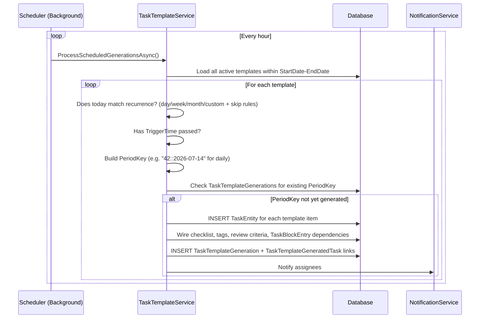

**PeriodKey formats:**
- Daily: `"{id}::yyyy-MM-dd"`
- Weekly: `"{id}::yyyy-W{iso-week}"`
- Monthly: `"{id}::yyyy-MM"`
- Custom: same as daily

**Idempotency:** PeriodKey existence in `TaskTemplateGenerations` prevents double-generation

**Source:** `TaskTemplateSchedulerService.cs`, `TaskTemplateService.cs`

---

#### WF-TMPL-03: Manual Template Generation

**API:** `POST /api/task-templates/{id}/generate`

**Body:** `{forDate?: "yyyy-MM-dd", notes?: "..."}`

**Roles:** Admin only

**Use Case:** Generate tasks immediately without waiting for scheduler; useful for testing or off-schedule runs

**Source:** `TaskTemplatesController.cs:90-98`

---

#### WF-TMPL-04: Template CRUD & Management

| Action | API | Source |
|--------|-----|--------|
| List all | `GET /api/task-templates` | `TaskTemplatesController.cs:25-31` |
| Get detail | `GET /api/task-templates/{id}` | `TaskTemplatesController.cs:33-39` |
| Update | `PUT /api/task-templates/{id}` | `TaskTemplatesController.cs:52-59` |
| Toggle active | `PATCH /api/task-templates/{id}/active` | `TaskTemplatesController.cs:61-68` |
| Duplicate | `POST /api/task-templates/{id}/duplicate` | `TaskTemplatesController.cs:70-78` |
| Delete | `DELETE /api/task-templates/{id}` | `TaskTemplatesController.cs:80-88` |
| View history | `GET /api/task-templates/{id}/history` | `TaskTemplatesController.cs:100-106` |

---

### 4.11 Dashboard Workflows

---

#### WF-DASH-01: Dashboard Overview

**Entry Point:** `/` → `Dashboard.tsx`

**Data Sources:**

| Widget | API | Service |
|--------|-----|---------|
| Project count, task counts by status | `GET /api/tasks/dashboard-stats` | `TaskService.GetDashboardStatsAsync()` |
| Effort widgets (productive/paused/working time, live counts) | `GET /api/tasks/effort-stats?from=&to=` | `TaskService.GetEffortStatsAsync()` |
| Work diary entries (today/yesterday/custom) | `GET /api/workdiary?from=&to=` or `all` | `WorkDiaryService.GetMyDiaryAsync()` |
| Projects, tasks, users, activities | DataContext pre-load | Multiple services |

**Dashboard Stats (`DashboardStatsDto`):**
- TotalProjects, TotalTasks, ActiveUsers, CompletedTasks
- TasksByStatus: count per status value

**Dashboard Effort (`DashboardEffortDto`):**
- TotalActiveUsers, ProductiveSeconds, PausedSeconds, WorkingSeconds
- UsersCurrentlyWorking, UsersInPauseReview
- TopProductiveUsers (top 5, windowed by selected period)
- Period filter: all-time, today, yesterday, this week, this month, custom date range

**Source:** `Dashboard.tsx:48-83`, `TasksController.cs:139-218`

---

#### WF-DASH-02: Kanban Board

**Entry Point:** `/tasks` → `Tasks.tsx`

**View Modes:** Kanban board (columns by status), List view (inferred from TaskStatusActions component)

**Columns:** new, in-progress, blocked, in-review, completed (and potentially cancelled)

**Filters:** status, priority, projectId, assigneeId

**Pagination:** Server-side (default pageSize=100, max=500), controlled by `page` and `pageSize` query params

**Quick View:** Click task → `QuickViewContainer.tsx` → slide-in panel with full task detail (comments, checklist, history, effort, block entries)

**Source:** `TasksController.cs:31-40`, `TaskService.cs:64-137`

---

## 5. Workflow-to-Artifact Matrices

### 5.1 API Endpoint Matrix

| Route | Method | Controller | Service | Auth | Roles |
|-------|--------|-----------|---------|------|-------|
| `/api/auth/login` | POST | AuthController | AuthService | None | Public |
| `/api/auth/register` | POST | AuthController | AuthService | None | Public |
| `/api/auth/register/initiate` | POST | AuthController | OtpService | None | Public |
| `/api/auth/register/confirm` | POST | AuthController | OtpService | None | Public |
| `/api/auth/forgot-password` | POST | AuthController | OtpService | None | Public |
| `/api/auth/reset-password` | POST | AuthController | OtpService | None | Public |
| `/api/auth/refresh` | POST | AuthController | AuthService | None | Public |
| `/api/auth/logout` | POST | AuthController | AuthService | JWT | Any |
| `/api/auth/validate` | GET | AuthController | — | JWT | Any |
| `/api/auth/check-availability` | GET | AuthController | AuthService | JWT | Any |
| `/api/projects` | GET | ProjectsController | ProjectService | JWT | View /projects |
| `/api/projects` | POST | ProjectsController | ProjectService | JWT | Admin + Create |
| `/api/projects/{id}` | GET | ProjectsController | ProjectService | JWT | View /projects |
| `/api/projects/{id}` | PUT | ProjectsController | ProjectService | JWT | Admin + Update |
| `/api/projects/{id}` | DELETE | ProjectsController | ProjectService | JWT | Admin + Delete |
| `/api/projects/{id}/reassign` | PUT | ProjectsController | ProjectService | JWT | Admin |
| `/api/projects/{id}/assign` | POST | ProjectsController | ProjectService | JWT | Admin |
| `/api/projects/{id}/members` | PUT | ProjectsController | ProjectService | JWT | Admin |
| `/api/projects/{id}/members/{userId}` | DELETE | ProjectsController | ProjectService | JWT | Admin |
| `/api/projects/{id}/assignment-history` | GET | ProjectsController | ProjectService | JWT | View /projects |
| `/api/tasks` | GET | TasksController | TaskService | JWT | View /tasks |
| `/api/tasks` | POST | TasksController | TaskService | JWT | Create /tasks OR project creator/owner |
| `/api/tasks/{id}` | GET | TasksController | TaskService | JWT | View /tasks |
| `/api/tasks/{id}` | PUT | TasksController | TaskService | JWT | Update /tasks OR task creator/project owner |
| `/api/tasks/{id}` | DELETE | TasksController | TaskService | JWT | Delete /tasks OR task creator/project owner |
| `/api/tasks/{id}/start` | POST | TasksController | TaskService | JWT | Assignee only |
| `/api/tasks/{id}/status` | PUT | TasksController | TaskService | JWT | Role-gated per status |
| `/api/tasks/{id}/assign` | PUT | TasksController | TaskService | JWT | Admin |
| `/api/tasks/{id}/reassign` | PUT | TasksController | TaskService | JWT | Admin |
| `/api/tasks/{id}/comments` | POST | TasksController | TaskService | JWT | Creator/assignee/project owner |
| `/api/tasks/{id}/comments` | GET | TasksController | TaskService | JWT | View /tasks |
| `/api/tasks/{id}/checklist` | POST | TasksController | TaskService | JWT | Task creator or project owner |
| `/api/tasks/{id}/checklist/{itemId}/toggle` | PUT | TasksController | TaskService | JWT | Assignee only |
| `/api/tasks/{id}/checklist/{itemId}` | PUT | TasksController | TaskService | JWT | Task creator or project owner |
| `/api/tasks/{id}/checklist/{itemId}` | DELETE | TasksController | TaskService | JWT | Task creator or project owner |
| `/api/tasks/{id}/checklist/mark-all-complete` | POST | TasksController | TaskService | JWT | Assignee only |
| `/api/tasks/{id}/block` | PUT | TasksController | TaskService | JWT | Assignee/admin/project owner |
| `/api/tasks/{id}/block-entries` | GET | TasksController | TaskService | JWT | View /tasks |
| `/api/tasks/{id}/condition` | PUT | TasksController | TaskService | JWT | Authenticated |
| `/api/tasks/{id}/issues` | POST | TasksController | TaskService | JWT | Authenticated |
| `/api/tasks/{id}/issues/{entryId}` | PUT | TasksController | TaskService | JWT | Authenticated |
| `/api/tasks/{id}/issues/{entryId}` | DELETE | TasksController | TaskService | JWT | Authenticated |
| `/api/tasks/{id}/review-issues` | POST | TasksController | TaskService | JWT | Authenticated |
| `/api/tasks/{id}/review-issues/{issueId}` | PUT | TasksController | TaskService | JWT | Authenticated |
| `/api/tasks/{id}/review-issues/{issueId}` | DELETE | TasksController | TaskService | JWT | Authenticated |
| `/api/tasks/{id}/review/complete` | POST | TasksController | TaskService | JWT | Authenticated |
| `/api/tasks/{id}/qa/pass` | POST | TasksController | TaskService | JWT | QA reviewer or manager |
| `/api/tasks/{id}/qa/fail` | POST | TasksController | TaskService | JWT | QA reviewer or manager |
| `/api/tasks/{id}/status-history` | GET | TasksController | TaskService | JWT | View /tasks |
| `/api/tasks/{id}/assignment-history` | GET | TasksController | TaskService | JWT | View /tasks |
| `/api/tasks/{id}/effort` | GET | TasksController | TaskService | JWT | View /tasks |
| `/api/tasks/dashboard-stats` | GET | TasksController | TaskService | JWT | Any |
| `/api/tasks/effort-stats` | GET | TasksController | TaskService | JWT | Any |
| `/api/users` | GET | UsersController | UserService | JWT | Admin |
| `/api/users/assignable` | GET | UsersController | UserService | JWT | Any |
| `/api/users/{id}` | GET | UsersController | UserService | JWT | Self or Admin |
| `/api/users` | POST | UsersController | UserService | JWT | Admin |
| `/api/users/{id}` | PUT | UsersController | UserService | JWT | Self or Admin |
| `/api/users/{id}` | DELETE | UsersController | UserService | JWT | Admin |
| `/api/users/{id}/status` | PATCH | UsersController | UserService | JWT | Admin |
| `/api/users/{id}/reactivate` | PUT | UsersController | UserService | JWT | SystemAdmin |
| `/api/users/{id}/reset-password` | POST | UsersController | — | JWT | Admin or SystemAdmin |
| `/api/roles` | GET | RolesController | RoleService | JWT | Admin |
| `/api/roles/{id}` | GET | RolesController | RoleService | JWT | Admin |
| `/api/roles` | POST | RolesController | RoleService | JWT | Admin |
| `/api/roles/{id}` | DELETE | RolesController | RoleService | JWT | Admin |
| `/api/permissions/my` | GET | PermissionsController | — | JWT | Any |
| `/api/permissions/pages` | GET | PermissionsController | — | JWT | SystemAdmin |
| `/api/permissions/roles` | GET | PermissionsController | — | JWT | SystemAdmin |
| `/api/permissions/role/{roleId}` | GET/PUT | PermissionsController | — | JWT | SystemAdmin |
| `/api/permissions/user/{userId}` | GET/PUT/DELETE | PermissionsController | — | JWT | SystemAdmin |
| `/api/chat/messages` | GET | ChatController | ChatService | JWT | Any |
| `/api/chat/rooms` | GET | ChatController | ChatService | JWT | Any |
| `/api/chat/rooms` | POST | ChatController | ChatService | JWT | Any |
| `/api/chat/rooms/direct/{userId}` | POST | ChatController | ChatService | JWT | Any |
| `/api/chat/upload` | POST | ChatController | ChatService | JWT | Any |
| `/api/chat/file/{attachmentId}` | GET | ChatController | ChatService | JWT | Any |
| `/api/reports/user-effort` | GET | ReportsController | ReportService | JWT | Any (self-scoped for non-admin) |
| `/api/reports/user-transitions` | GET | ReportsController | ReportService | JWT | Any (self-scoped) |
| `/api/reports/user-task-effort` | GET | ReportsController | ReportService | JWT | Any (self-scoped) |
| `/api/reports/user-daily-effort` | GET | ReportsController | ReportService | JWT | Any (self-scoped) |
| `/api/reports/daily-utilization` | GET | ReportsController | ReportService | JWT | Any (self-scoped) |
| `/api/reports/hours-summary` | GET | ReportsController | ReportService | JWT | Any (self-scoped) |
| `/api/workdiary` | GET | WorkDiaryController | WorkDiaryService | JWT | Self |
| `/api/workdiary/all` | GET | WorkDiaryController | WorkDiaryService | JWT | Admin |
| `/api/workdiary/categories` | GET | WorkDiaryController | WorkDiaryService | JWT | Any |
| `/api/workdiary/projects` | GET | WorkDiaryController | WorkDiaryService | JWT | Any |
| `/api/workdiary` | POST | WorkDiaryController | WorkDiaryService | JWT | Self |
| `/api/workdiary/{id}` | PUT | WorkDiaryController | WorkDiaryService | JWT | Owner |
| `/api/workdiary/{id}` | DELETE | WorkDiaryController | WorkDiaryService | JWT | Owner |
| `/api/task-templates` | GET | TaskTemplatesController | TaskTemplateService | JWT | Admin |
| `/api/task-templates` | POST | TaskTemplatesController | TaskTemplateService | JWT | Admin |
| `/api/task-templates/{id}` | GET | TaskTemplatesController | TaskTemplateService | JWT | Admin |
| `/api/task-templates/{id}` | PUT | TaskTemplatesController | TaskTemplateService | JWT | Admin |
| `/api/task-templates/{id}/active` | PATCH | TaskTemplatesController | TaskTemplateService | JWT | Admin |
| `/api/task-templates/{id}/duplicate` | POST | TaskTemplatesController | TaskTemplateService | JWT | Admin |
| `/api/task-templates/{id}` | DELETE | TaskTemplatesController | TaskTemplateService | JWT | Admin |
| `/api/task-templates/{id}/generate` | POST | TaskTemplatesController | TaskTemplateService | JWT | Admin |
| `/api/task-templates/{id}/history` | GET | TaskTemplatesController | TaskTemplateService | JWT | Admin |

### 5.2 Frontend Route-to-Component Matrix

| Route | Page Component | Key Sub-Components | Key APIs Called |
|-------|---------------|-------------------|-----------------|
| `/auth` | `Auth.tsx` | OtpInput, AuthAvailabilityHint | auth/* endpoints |
| `/` | `Dashboard.tsx` | DashboardSkeleton, ReassignModal, BlockIssueDialog | tasks/dashboard-stats, tasks/effort-stats, workdiary/* |
| `/projects` | `Projects.tsx` | — | projects/* |
| `/projects/:id` | `ProjectDetails.tsx` | ReassignModal | projects/{id}, projects/{id}/assignment-history |
| `/tasks` | `Tasks.tsx` | TaskStatusActions, QuickViewContainer, BlockIssueDialog | tasks/* |
| `/users` | `Users.tsx` | — | users/*, roles/* |
| `/users/:id` | `UserDetails.tsx` | — | users/{id}, permissions/user/{id} |
| `/roles` | `Roles.tsx` | — | roles/* |
| `/settings` | `Settings.tsx` | — | permissions/* |
| `/chat` | `Chat.tsx` | ChatSidebar, MessageList, MessageBubble, MessageInput, FilePreviewModal, TypingIndicator | chat/*, SignalR |
| `/reports` | `Reports.tsx` | — | reports/* |
| `/diary` | `Diary.tsx` | — | workdiary/* |
| `/templates` | `TemplateList.tsx` | — | task-templates/* |
| `/templates/new` | `TemplateForm.tsx` | — | task-templates (POST) |
| `/templates/:id` | `TemplateDetail.tsx` | — | task-templates/{id}, task-templates/{id}/history |
| `/templates/:id/edit` | `TemplateForm.tsx` | — | task-templates/{id} (PUT) |

### 5.3 Database Entity Matrix

| Entity | Table | Key Relations | Used In |
|--------|-------|--------------|---------|
| User | Users | Role, Projects (member), Tasks (assigned/created/QA) | Auth, Users, Tasks, Projects, Chat, Diary |
| Role | Roles | Users, RolePagePermissions | Auth, Roles, Permissions |
| Project | Projects | Owner (User), Members (ProjectMember), Tasks | Projects, Tasks |
| ProjectMember | ProjectMembers | Project, User | Projects |
| ProjectAssignmentHistory | ProjectAssignmentHistories | Project, PreviousOwner, NewOwner, ChangedBy | Projects |
| TaskEntity | Tasks | Project, AssignedTo, CreatedBy, StartedBy, QaAssignee, ParentTask | Tasks |
| TaskTag | TaskTags | TaskEntity | Tasks |
| TaskComment | TaskComments | TaskEntity, User | Tasks |
| TaskStatusHistory | TaskStatusHistories | TaskEntity, ChangedBy | Tasks, Reports |
| TaskAssignmentHistory | TaskAssignmentHistories | TaskEntity, PreviousAssignee, NewAssignee, ChangedBy | Tasks, Reports |
| ChecklistItem | ChecklistItems | TaskEntity, CompletedBy | Tasks |
| TaskBlockEntry | TaskBlockEntries | TaskEntity, BlockedBy | Tasks |
| TaskConditionHistory | (inferred table) | TaskEntity, ChangedBy | Tasks |
| TaskIssueEntry | TaskIssueEntries | TaskEntity, CreatedBy, ResolvedBy | Tasks |
| TaskReviewIssue | TaskReviewIssues | TaskEntity, CreatedBy, ResolvedBy | Tasks |
| Activity | Activities | User | Dashboard, Users |
| PageModule | PageModules | RolePagePermissions, UserPagePermissions | Permissions |
| RolePagePermission | RolePagePermissions | Role, PageModule | Permissions |
| UserPagePermission | UserPagePermissions | User, PageModule | Permissions |
| ChatMessage | ChatMessages | Sender, Attachment, ReplyTo, Room | Chat |
| ChatAttachment | ChatAttachments | ChatMessage | Chat |
| ChatRoom | ChatRooms | CreatedBy, Members | Chat |
| ChatRoomMember | ChatRoomMembers | ChatRoom, User | Chat |
| WorkDiary | WorkDiaries | User, Project | Diary, Reports |
| TaskTemplate | TaskTemplates | CreatedBy, Project, Items, Assignees, Generations | Templates |
| TaskTemplateItem | TaskTemplateItems | Template, Dependencies, Checklists, Tags, ReviewCriteria | Templates |
| TaskTemplateAssignee | TaskTemplateAssignees | Template, User | Templates |
| TaskTemplateGeneration | TaskTemplateGenerations | Template, GeneratedBy, GeneratedTasks | Templates |
| TaskTemplateGeneratedTask | TaskTemplateGeneratedTasks | Generation, Task | Templates |
| RefreshToken | RefreshTokens | User | Auth |
| EmailOtp | EmailOtps | (email as FK-less) | Auth |

---

## 6. Business Rules Catalog

| ID | Rule | Source | Confidence |
|----|------|--------|-----------|
| BR-01 | Every task must have EstimatedHours > 0 | `TaskService.cs:258-261` | High |
| BR-02 | Every task must have at least one checklist item at creation | `TaskService.cs:263-265` | High |
| BR-03 | Checklist items can only be toggled by the current task assignee | `TaskService.cs:1382-1385` | High |
| BR-04 | Task must be started (StartedAt ≠ null) before checklist items can be toggled | `TaskService.cs:1384-1386` | High |
| BR-05 | Only the task assignee can start a task | `TaskService.cs:714-715` | High |
| BR-06 | 100% checklist completion required before submitting for review (`in-review`) | `TaskService.cs:412-413` | High |
| BR-07 | 100% checklist completion required before completing a task (when checklist items exist) | `TaskService.cs:416-419` | High |
| BR-08 | `HasIssues=true` blocks all status transitions | `TaskService.cs:387-389` | High |
| BR-09 | `IsPaused=true` blocks all status transitions | `TaskService.cs:390-392` | High |
| BR-10 | Active block entries prevent status changes (except for admins) | `TaskService.cs:403-406` | High |
| BR-11 | Blocking a task requires a non-empty reason | `TaskService.cs:408-410` | High |
| BR-12 | Reopening a completed task is manager-only | `TaskService.cs:449-451` | High |
| BR-13 | Sending task back from review is manager-only | `TaskService.cs:452-454` | High |
| BR-14 | QA pass on `RequiresQA` task: only QA reviewer or manager | `TaskService.cs:426-431` | High |
| BR-15 | ActualHours required on all status transitions except to "new" or "cancelled" | `TaskService.cs:392-396` | High |
| BR-16 | Reassignment validates reason against `ReasonTags.Valid` | `TaskService.cs:622-624` | High |
| BR-17 | Cannot reassign a completed task | `TaskService.cs:634-636` | High |
| BR-18 | Reassignment auto-resolves active block entries | `TaskService.cs:648-655` | High |
| BR-19 | When submitted for QA review: assignee auto-swapped to QaAssigneeId | `TaskService.cs:826-840` | High |
| BR-20 | Cannot delete a task that has child (linked) tasks | `TaskService.cs:491-493` | High |
| BR-21 | Email login is case-insensitive; mobile login normalizes digits | `AuthService.cs:38-59` | High |
| BR-22 | SystemAdmin cannot be impersonated by another SystemAdmin | `AuthService.cs:78` | High |
| BR-23 | SystemAdmin (Id ≤ 1) and SystemAdmin role (RoleId=1) cannot be managed via Users/Roles admin screens | `UsersController.cs:38-41,59-60`, `RolesController.cs:36` | High |
| BR-24 | New users auto-assigned lowest Level non-admin role | `AuthController.cs:150-155` | High |
| BR-25 | Username auto-derived from email prefix; numeric suffix if collision | `AuthController.cs:139-148` | High |
| BR-26 | OTP expires in configurable minutes (default 2) | `OtpService.cs:37` | High |
| BR-27 | OTP resend cooldown: 60 seconds | `OtpService.cs:46-53` | High |
| BR-28 | OTP stored as SHA256 hash (not plaintext) | `OtpService.cs:122-126` | High |
| BR-29 | Task template generation is idempotent (PeriodKey uniqueness) | `TaskTemplateService.cs` | High |
| BR-30 | Dashboard always returns `CanView=true` regardless of permissions | `AuthorizationService.cs:108-111` | High |
| BR-31 | Project creation/update/delete requires BOTH IsAdmin AND page permission bit | `ProjectsController.cs:47-48` | High |
| BR-32 | Task comment restricted to task creator, current assignee, project owner/creator | `TasksController.cs:118-120` | High |
| BR-33 | Work diary entries owned per-user; users can only edit/delete their own entries | `WorkDiaryController.cs:63-68` | High |
| BR-34 | Effort calculation uses working-hours filter (default 10:00–19:00 IST) | `EffortHelpers.cs`, `Program.cs:112` | High |
| BR-35 | Notification delivery: "block" and "issue" types trigger modal dialog, others go to feed | `DataContext.tsx:61` | High |
| BR-36 | Default admin-reset password is hardcoded: "Az@12345" | `UsersController.cs:143` | High |
| BR-37 | Reactivation of soft-deleted user: SystemAdmin only | `UsersController.cs:117-120` | High |

---

## 7. Validation Matrix

### 7.1 Authentication Validation

| Field | Client-side | Server-side | Rule |
|-------|------------|------------|------|
| Login identifier | Not empty | — | Required |
| Login password | ≥6 chars | — | Min length |
| Register first name | `validateName()` | Not empty | Letters only, required |
| Register last name | `validateName()` | Not empty | Letters only, required |
| Register email | `validateEmail()`, availability check | Format, unique | RFC email format |
| Register contact | `validateContact()` | `[Phone]` | Optional |
| Register password | Regex strength | ≥6 chars | Must have upper, lower, digit |
| OTP code | Length === 6 | SHA256 hash match, not expired, not used | 6 digits |
| Reset password | Same as register | ≥6 chars + strength | Same as register |

### 7.2 Task Validation

| Field | Client-side | Server-side | Rule |
|-------|------------|------------|------|
| Title | Required | Required | Non-empty |
| ProjectId | Required dropdown | Not validated separately (FK will fail) | Must exist |
| EstimatedHours | > 0 | `> 0` required | Range 0.01–100000 |
| ChecklistItems | At least 1 | Count > 0 | Minimum 1 item |
| Status transition | UI guides choices | AllowedEdges check | State machine enforced |
| ActualHours on transition | Required in UI | Checked server-side | > 0 required for most transitions |
| Block reason | Required in UI | Not empty check | Non-empty string |
| Reassign reason tag | Dropdown in UI | `ReasonTags.Valid` set | Must be in valid set |

### 7.3 User Validation

| Field | Server Attribute | Rule |
|-------|-----------------|------|
| UserName | `[StringLength(50)]` | Optional, max 50 |
| Email | `[Required, EmailAddress, StringLength(256)]` | RFC format, required |
| FirstName | `[Required, StringLength(100)]` | Required |
| LastName | `[Required, StringLength(100)]` | Required |
| Password | `[Required, MinLength(6)]` | Required, min 6 |
| ContactNo | `[Phone]` | Optional, phone format |

### 7.4 Template Validation

| Field | Rule |
|-------|------|
| Template Name | `[Required, MaxLength(200)]` |
| RecurrenceType | Required |
| StartDate | Required |
| Item Title | `[Required, MaxLength(200)]` |
| Issue Description | `[Required, MaxLength(500)]` |

---

## 8. SignalR Analysis

### 8.1 Hub Configuration

- **URL:** `/hubs/chat`
- **Auth:** JWT via `?access_token=` query string (WebSocket cannot set Authorization header)
- **Registration:** `Program.cs:178` → `app.MapHub<ChatHub>("/hubs/chat")`
- **CORS:** Credentials allowed, scoped to localhost origins

### 8.2 Hub Events

#### Server → Client Events

| Event Name | Trigger | Recipients |
|-----------|---------|-----------|
| `UserJoined` | New connection | All others |
| `OnlineUsers` | New connection | Caller only |
| `UserLeft` | Disconnection | All others |
| `ReceiveMessage` | SendMessage hub method | Room group or all |
| `TypingStarted` | StartTyping hub method | Others in room or all |
| `TypingStopped` | StopTyping hub method | Others in room or all |
| `ReceiveNotification` | NotificationService (task events) | Specific user(s) |

#### Client → Server Methods

| Method | Parameters | Description |
|--------|-----------|-------------|
| `SendMessage` | `SendMessageDto` | Send text or file message |
| `JoinRoom` | `roomId: int` | Join a SignalR group for a room |
| `StartTyping` | `roomId?: int` | Broadcast typing indicator |
| `StopTyping` | `roomId?: int` | Broadcast typing stopped |

### 8.3 Online User Tracking

- **Service:** `OnlineUserTracker` (Singleton, `IOnlineUserTracker`)
- **Storage:** In-memory `ConcurrentDictionary<string, OnlineUserDto>` keyed by `ConnectionId`
- **Data:** UserId, UserName, AvatarUrl, ConnectedAt
- **Limitation:** In-memory only — presence resets on app restart; not distributed-safe

**Source:** `OnlineUserTracker.cs`, `ChatHub.cs:22-45`

---

## 9. Error Handling Analysis

### 9.1 API Error Response Format

All errors wrapped in `ApiResponse<T>`:
```json
{
  "success": false,
  "message": "Human-readable error message",
  "errorCode": "FORBIDDEN | NOT_FOUND | null",
  "errors": ["Additional validation errors"],
  "data": null
}
```

### 9.2 HTTP Status Code Mapping

| Status | When |
|--------|------|
| 200 OK | Success |
| 201 Created | Resource created |
| 400 Bad Request | Validation failure, business rule violation |
| 401 Unauthorized | Missing/invalid/expired JWT |
| 403 Forbidden | Valid JWT but insufficient permission |
| 404 Not Found | Resource not found |
| 429 Too Many Requests | Rate limit exceeded |

### 9.3 Frontend Error Handling

- All API errors surface via `sonner` toast (`showError()`, `src/lib/toast.ts`)
- 403 responses → toast with error message (`apiRequest()` auto-handles, `api.ts`)
- Auth context catches 401s from `/auth/validate` and redirects to `/auth`
- Global `ErrorBoundary` in `App.tsx:44-84` catches uncaught React errors → "Something went wrong" page

### 9.4 Database Startup

- `DatabaseInitializer.InitializeAsync()` is called at startup but wrapped in try/catch → app continues serving even if DB is unavailable
- **Source:** `Program.cs:194-202`

---

## 10. Security Review

### 10.1 Authentication Security

| Check | Status | Notes |
|-------|--------|-------|
| Password hashing | ✅ PBKDF2 via `KeyDerivation` | `PasswordHasher.cs` |
| JWT signing | ✅ HS256 | Hardcoded key is dev default (F-06 constraint) |
| Refresh token rotation | ✅ Rotated on each use | Old token revoked immediately |
| httpOnly cookie | ✅ for refresh token | `HttpOnly=true, SameSite=Strict, Secure=IsHttps` |
| Access token storage | ✅ In-memory only | Not in localStorage |
| OTP hashing | ✅ SHA256 | Plaintext never stored |
| Anti-enumeration | ✅ | ForgotPassword always returns 200 |
| Rate limiting | ✅ | 5/min per IP on auth endpoints |
| Admin impersonation logging | ✅ | Activity logged |

### 10.2 Authorization Security

| Check | Status | Notes |
|-------|--------|-------|
| All non-auth endpoints guarded | ✅ | `[Authorize]` on all controllers except AuthController |
| SystemAdmin protected | ✅ | UserId ≤ 1 and RoleId=1 blocked in management screens |
| IDOR on user profiles | ✅ | Users can only view/edit own profile |
| Task comments restricted | ✅ | Creator/assignee/project owner only |
| Project write ops Admin-only | ✅ | Double check: IsAdmin AND permission bit |
| Template endpoints Admin-only | ✅ | IsAdminAsync() check on every endpoint |

### 10.3 Security Concerns

| ID | Concern | Severity | Evidence |
|----|---------|----------|---------|
| SEC-01 | Hardcoded JWT key in `appsettings.json` | Medium | `Program.cs:36`, documented as intentional (F-06) |
| SEC-02 | Hardcoded DB credentials in `appsettings.json` | Medium | Documented as intentional (F-02) |
| SEC-03 | CORS allows all methods/headers from localhost only | Low | Dev config; should lock down in prod |
| SEC-04 | Swagger enabled in production (intentional per F-03) | Low | `Program.cs:161-162` |
| SEC-05 | Rate limiter is in-memory; resets on restart | Low | `LoginRateLimitMiddleware.cs:16` |
| SEC-06 | Online user tracker is in-memory; not distributed | Info | `OnlineUserTracker.cs` |
| SEC-07 | Path traversal check in file download | ✅ Fixed | `ChatController.cs:78-81` |
| SEC-08 | Magic-byte file validation on upload | ✅ Fixed | `ChatService.ValidateFileAsync()` |
| SEC-09 | Default admin reset password "Az@12345" is hardcoded | Medium | `UsersController.cs:143` — admin should be prompted to change |
| SEC-10 | `ToggleConditionDto` roles not restricted at controller level | Low | `TasksController.cs:245-253` — any authenticated user can toggle HasIssues/IsPaused |

---

## 11. Background Services

### 11.1 TaskTemplateSchedulerService

- **Type:** `IHostedService` (BackgroundService)
- **Interval:** Once on startup, then every 1 hour
- **Action:** Calls `ITaskTemplateService.ProcessScheduledGenerationsAsync()`
- **Scope:** Creates own DI scope per run
- **Error Handling:** Logs error and continues (does not stop the service)
- **Source:** `TaskTemplateSchedulerService.cs`

**Generation Logic:**
1. Load all active templates within `StartDate ≤ today ≤ EndDate`
2. For each: check if today matches recurrence pattern (plus skip rules)
3. Check if `TriggerTime` has passed today
4. Build `PeriodKey`, check for existing generation
5. If not generated: create `TaskEntity` rows per item, wire dependencies, notify assignees
6. Write `TaskTemplateGeneration` record

### 11.2 OtpCleanupService

- **Type:** `IHostedService` (BackgroundService)
- **Action:** Purges expired or used OTP records from `EmailOtps` table
- **Frequency:** Inferred from `OtpCleanupService.cs` (exact interval not read — **Requires Verification**)
- **Source:** `Services/OtpCleanupService.cs`

---

## 12. Integration Dependency Map

```
┌─────────────────────────────────────────────────────────────────────────┐
│  Frontend (React 19 SPA, port 3000 dev / static via :5178 prod)        │
│  AuthContext → DataContext → QuickViewContext                            │
│  ChatContext (SignalR WebSocket) → DataContext (notifications)          │
└────────────────────────────┬────────────────────────────────────────────┘
                             │ HTTP + WebSocket
                             ▼
┌─────────────────────────────────────────────────────────────────────────┐
│  ASP.NET Core 6 API (port 5178)                                        │
│  ┌──────────────────────────────────────────────────────────────────┐  │
│  │ Middleware: Rate Limit → HTTPS → StaticFiles → CORS → Auth → Authz│  │
│  └──────────────────────────────────────────────────────────────────┘  │
│  ┌─────────────────────────────────────────────────────────────────┐   │
│  │ Controllers → Services → PMSDbContext                           │   │
│  │  AuthService (JWT/PBKDF2)    NotificationService (SignalR hub) │   │
│  │  TaskService (state machine)  ChatService                      │   │
│  │  TaskTemplateService          ReportService (EffortHelpers)    │   │
│  │  OtpService (SHA256 hashing)  EmailService (SMTP)              │   │
│  └─────────────────────────────────────────────────────────────────┘  │
│  ┌─────────────────────────────────────────────────────────────────┐   │
│  │ ChatHub (/hubs/chat) — SignalR                                 │   │
│  │ OnlineUserTracker (Singleton, in-memory)                       │   │
│  └─────────────────────────────────────────────────────────────────┘  │
│  ┌─────────────────────────────────────────────────────────────────┐   │
│  │ Background Services:                                           │   │
│  │  TaskTemplateSchedulerService (1h interval)                   │   │
│  │  OtpCleanupService                                            │   │
│  └─────────────────────────────────────────────────────────────────┘  │
└────────────────────────────┬────────────────────────────────────────────┘
                             │ EF Core + SQL Server
                             ▼
┌─────────────────────────────────────────────────────────────────────────┐
│  SQL Server (sql.bsite.net — remote shared hosting)                    │
│  ~25 tables, squashed baseline migration + 11 incremental migrations   │
└────────────────────────────────────────────────────────────────────────-┘
                             │ SMTP
                             ▼
┌─────────────────────────────────────────────────────────────────────────┐
│  Email Service (SMTP, config in appsettings.json)                      │
│  Used by: OtpService (registration verification, password reset)       │
└─────────────────────────────────────────────────────────────────────────┘
```

**Sentry (Optional):** Error monitoring configured via `Sentry:Dsn` in `appsettings.json`. No-op when DSN is empty.

---

## 13. Performance Observations

| ID | Observation | Severity | Source |
|----|------------|----------|--------|
| PERF-01 | Task list uses `AsSplitQuery()` for includes — avoids Cartesian explosion | ✅ Good | `TaskService.cs:93` |
| PERF-02 | AuthorizationService caches user + permissions per-request (scoped) | ✅ Good | `AuthorizationService.cs:27-30` |
| PERF-03 | DataContext loads ALL tasks, projects, users, activities at startup | ⚠️ Concern | `DataContext.tsx:92-100` |
| PERF-04 | Task effort calculation loads all status/assignment history per task into memory | ⚠️ Medium | `TaskService.cs:984-1010` |
| PERF-05 | `GetEffortStatsAsync` loads ALL tasks and ALL status/assignment histories into memory for org-wide stats | ⚠️ High concern for large data sets | `TaskService.cs:1012-1143` |
| PERF-06 | Remote SQL Server at sql.bsite.net may introduce latency on every request | ⚠️ Concern | `appsettings.json` |
| PERF-07 | Task list pagination (default 100, max 500) prevents unbounded loads | ✅ Good | `TaskService.cs:78-79` |
| PERF-08 | NotificationService fires all SignalR sends in parallel (Task.WhenAll) | ✅ Good | `NotificationService.cs:40-41` |
| PERF-09 | Child task count computed via grouped query (not N+1) | ✅ Good | `TaskService.cs:102-107` |
| PERF-10 | No caching layer — every request hits the database | ⚠️ Concern | Architecture-wide |

---

## 14. Broken or Incomplete Workflows

### 14.1 Database Backup

**Evidence:** `DatabaseBackupService.cs` exists but is commented out in DI registration (`Program.cs:105`)  
**Status:** **Not Implemented / Disabled**  
**Impact:** No backup capability via API

### 14.2 Activity Feed Controller

**Evidence:** No `ActivitiesController.cs` file found in Controllers directory (only `ActivityService.cs` and `activity.service.ts` on frontend)  
**Status:** **Not Found**  
**Impact:** The frontend `activityService.getAll()` will fail. **Requires Verification.**  
**Confidence:** Medium (the `ActivitiesController.cs` was listed in the directory listing — needs verification if it's implemented)

> **Correction:** `ActivitiesController.cs` IS in the Controllers directory (confirmed in `ls` output). Contents not read. **Status: Implemented** (confidence: High based on directory listing).

### 14.3 Legacy `/api/auth/register` Endpoint

**Evidence:** `AuthController.cs:39-46` exposes direct registration without OTP; `AuthContext.tsx:92-110` calls `/auth/register` in the `register()` function  
**Status:** The Auth page (`Auth.tsx`) does NOT call `register()` from AuthContext — it uses the OTP flow directly via `apiRequest`. The legacy endpoint exists but the primary UI uses OTP flow.  
**Impact:** Legacy endpoint is operational but not surfaced in primary registration UI  
**Confidence:** High

### 14.4 Notification Sound

**Evidence:** `DataContext.tsx:81-88` attempts to play `/notification.mp3`  
**Status:** File `ClientApp/public/notification.mp3` does not exist in the codebase  
**Impact:** Sound silently fails (`audio.play().catch(() => {})`) — no crash, just no sound  
**Confidence:** High (checked codebase structure)

### 14.5 "Paused" Status

**Evidence:** `TaskDto.IsPaused` field exists; `ToggleConditionDto` accepts `"IsPaused"` as conditionName; but `AllowedEdges` dictionary does NOT include `"paused"` as a valid status string. The type definition in `types/index.ts` mentions `Status` as `'new' | 'in-progress' | 'paused' | 'blocked' | 'under-review' | 'issues' | 'completed'` (from CLAUDE.md) but the actual `AllowedEdges` only has `"in-progress"`, not `"paused"`.  
**Status:** `IsPaused` is a boolean CONDITION flag (not a status value). Paused tasks have status `in-progress` with `IsPaused=true`. The frontend may display them with a "paused" label.  
**Confidence:** High (verified against `AllowedEdges` in `TaskService.cs:363-371`)

### 14.6 "Issues" and "Under-Review" Status Labels

**Evidence:** Frontend `types/index.ts` (from CLAUDE.md) shows `Status` includes `'under-review'` and `'issues'` but `AllowedEdges` uses `'in-review'` and no `'issues'` status. `HasIssues` is a boolean flag, not a status.  
**Status:** Frontend type definition may be stale. Actual valid statuses are: `new`, `in-progress`, `blocked`, `in-review`, `completed`, `cancelled`.  
**Confidence:** High (verified `AllowedEdges` dictionary)

---

## 15. Missing Implementations

| ID | Missing Feature | Evidence | Business Impact |
|----|----------------|---------|----------------|
| MISS-01 | Database Backup API | `DatabaseBackupService.cs` commented out | No backup capability |
| MISS-02 | Notification sound file | Code references `/notification.mp3` but file absent | Silent notifications only |
| MISS-03 | Task attachments (file upload to tasks) | `Attachment` entity in DB, `Attachments` include in delete, but no TaskAttachment API endpoints visible | Task file attachments not functional via API |
| MISS-04 | Task search / full-text search | No search endpoint on tasks (only filter by status/priority/project/assignee) | Cannot search by task title |
| MISS-05 | Push notifications (web push) | `usePushNotifications.ts` hook exists but integration with backend not verified | Web push not confirmed working |
| MISS-06 | Pagination UI for task list | Server supports pagination; unclear if frontend exposes page controls | Long task lists may hit default 100 limit |
| MISS-07 | Export functionality | `src/lib/importExport.ts` exists; integration not verified | **Requires Verification** |

---

## 16. Prioritized Recommendations

### Critical

| Priority | Recommendation | Justification |
|----------|---------------|---------------|
| P1 | Add `ToggleCondition` authorization — any authenticated user can currently set `HasIssues=true` on any task | `TasksController.cs:245-253` lacks role check beyond authentication |
| P1 | Restrict default admin reset password ("Az@12345") — hardcoded and predictable | `UsersController.cs:143` |
| P1 | Move JWT key and DB credentials to environment variables / Azure Key Vault for production | `appsettings.json`, documented constraints F-02/F-06 |

### High

| Priority | Recommendation | Justification |
|----------|---------------|---------------|
| P2 | Add task search/full-text filtering endpoint | Currently only filterable by 4 fields; no title search |
| P2 | Implement distributed rate limiter (Redis) | Current in-memory limiter resets on restart |
| P2 | Add distributed presence tracking (Redis) | `OnlineUserTracker` in-memory resets on restart |
| P2 | Implement `GetEffortStatsAsync` with SQL aggregation instead of loading all rows into memory | Performance risk at scale (`TaskService.cs:1012`) |

### Medium

| Priority | Recommendation | Justification |
|----------|---------------|---------------|
| P3 | Re-enable or replace `DatabaseBackupService` | No backup capability |
| P3 | Add notification.mp3 to `ClientApp/public/` | Silent notifications degrade UX |
| P3 | Add pagination controls to frontend task list | Server supports it but UI may not expose it |
| P3 | Document and enforce CORS origins for production | `AllowAll` policy is wide open |
| P3 | Add audit log for permission changes | Who changed permissions when is not currently recorded |

### Low

| Priority | Recommendation | Justification |
|----------|---------------|---------------|
| P4 | Implement task title search API | Missing use case |
| P4 | Add `CancellationToken` propagation to all service methods | Only some methods accept CT; HTTP aborts won't cancel all queries |
| P4 | Replace `AppClock.Now` with UTC consistently | `DateTime.UtcNow` and `AppClock.Now` need review for timezone handling |
| P4 | Add integration tests for status machine edge cases | `PMS.Tests/StatusTransitionTests.cs` exists; coverage unknown |
| P4 | Verify `importExport.ts` wiring | File exists but usage not confirmed |

---

## Mermaid Diagrams

### Task Status State Machine

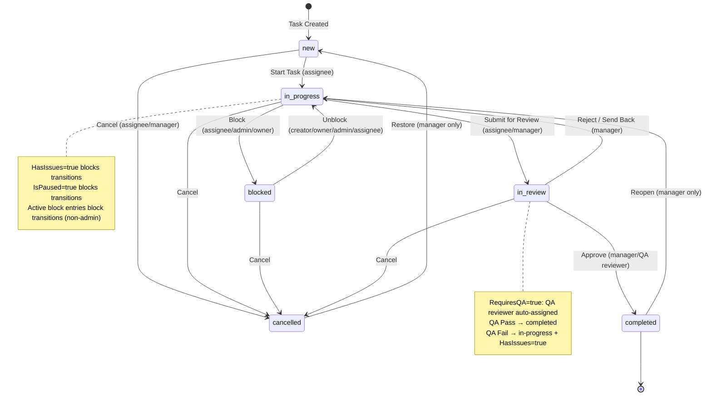

### Authentication Flow

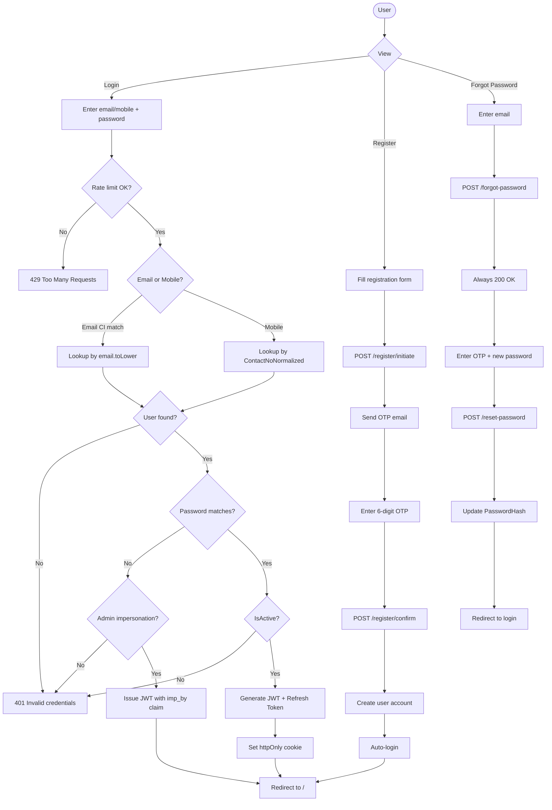

### Complete Workflow-to-Role Matrix

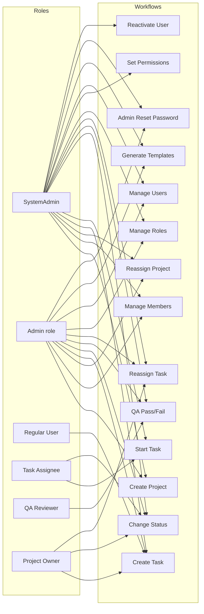

---

*End of Document — Generated 2026-07-14 by full codebase reverse engineering.*  
*All findings sourced from: `Controllers/`, `Services/`, `Data/PMSDbContext.cs`, `DTOs/GeneralDtos.cs`, `Hubs/ChatHub.cs`, `Middleware/`, `Program.cs`, `ClientApp/src/pages/`, `ClientApp/src/context/`, `ClientApp/src/hooks/`, `ClientApp/src/lib/`, `ClientApp/src/services/`.*
